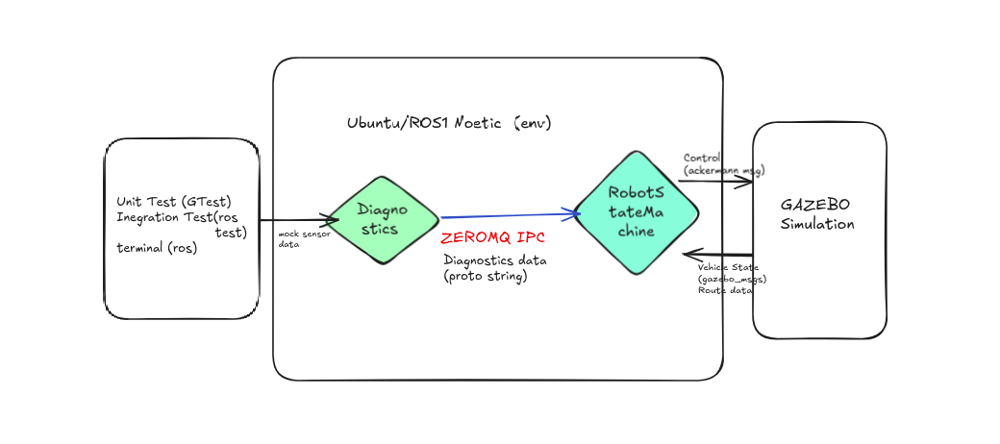
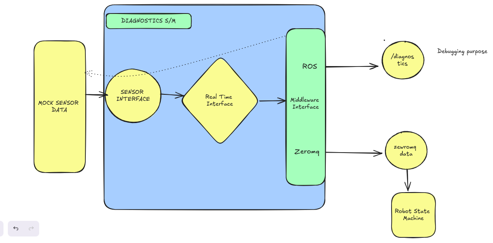

# Ground-Vehicle-Manager
This repository consists of software packages for managing higher-level tasks of an autonomous ground vehicle. It is implemented and tested in ROS Noetic and Ubuntu 20.04. There are two main ROS packages: one for diagnostics and another for the robot_state_machine.

## Major Requirements Considered:
The codebase is structured with the following in mind:

- Easy to choose the type of path-tracking controller.
- Easier to port to a different framework like ROS2.
- Easier to add more states to the controller.
- Real-time programming.
- Easier to deploy on a new platform.

## Feature Requirements:

### Mock sensor data and monitoring system with the following sensors:

- Battery
- Temperature
- GPS accuracy
- Internet signal strength
- Emergency stop

### Navigation Task Planner:
- A higher-level task planning system that handles decision-making and control of the vehicle/robot.

## System Design:

The system is designed and implemented by considering the given requirements. The entire system is divided into two packages: diagnostics and robot_state_machine. Each package has exactly one process associated with it. The design of the entire system at the highest level is shown below.



System running in an Ubuntu/ROS Noetic environment. Both diagnostics and state machine processes are started as ROS nodes, but the inter-process communication (IPC) between both processes does not use the ROS1 pub/sub or the service client model.

One of the important design requirements is real-time execution. ROS1 is not suitable for this, which is why ZeroMQ (https://zeromq.org/) was used, as it can handle soft real-time deadlines. An ideal choice could have been a standalone DDS protocol, but due to time and other limitations, ZeroMQ was selected as the IPC mechanism between both processes.

Real-time Publishers (http://wiki.ros.org/realtime_tools) are used for non-critical data sharing. One example is the robot_state topic from robot_state_machine.

Since multithreading is easier to handle in making the system deterministic, this implementation uses multiple threads to avoid unnecessary multiprocessing. All threads are implemented with higher priority and in a lock-free manner. This setup requires a Linux real-time kernel and root permission for execution.

Google Protobuf is used as the message structure in the diagnostics system to make it easier to port to other frameworks. Details of the diagnostics design are explained separately. A serialized string is passed as the data between the processes.

## Diagnostics System Design
This system helps generate and diagnose various sensor data. The entire architecture is designed with portability and real-time execution in mind.


### Code Structure:
#### Middleware:
- Provides an interface to implement any IPC middleware.
- Currently, ROS1 and ZeroMQ are implemented.
- The abstract middleware interface makes it easy to implement new middleware.
```cpp
class MiddlewareInterface {
public:
    virtual ~MiddlewareInterface() = default;

    virtual void initialize(int argc, char** argv) = 0;
    virtual void spin() = 0;
    virtual void publish(const std::string& message) = 0;
    virtual void subscribeAll() = 0;
    
    inline void addSubscribers(std::pair<const std::string, std::function<void(const std::string&)>> topic_and_callback)  {
        subscription_list.push_back(topic_and_callback);
    }

protected:
    std::vector<std::pair<std::string, std::function<void(const std::string&)>>> subscription_list;
};
```
#### RTI:

- Contains an implementation called RealTimeScheduler.
- This class can be used to execute any function in a real-time thread.
- The main diagnostics control uses this thread loop to gather all sensor data and check whether any sensor is reporting an error.

#### Sensors:

- Contains all sensor classes which collect relevant sensor data and diagnose it for errors.
- All classes inherit from a base sensor interface, making it easy to add new sensors to the system.
- All sensor classes subscribe to sensor messages through the intermediate interface.
```cpp
class SensorMonitorInterface {
public:
    virtual ~SensorMonitorInterface() = default;

    /**
     * @brief Interface to receive sensor data 
     * @param Protobuf-encoded string msg
     */
    virtual void collectData(const std::string& protobuf_data) = 0;
    
    /**
     * @brief Interface for performing diagnostics based on collected data
     */
    virtual void performDiagnostics() = 0;

    /**
     * @brief Interface to update diagnostics information for a particular sensor
     * @return diagnostics in string format
     */
    virtual std::string getDiagnosticsMessage() const = 0;

    virtual std::pair<std::string, std::function<void(const std::string&)>> getSubscribeTopics() const = 0;

    virtual bool isError() const = 0;

protected:
    std::string component_name_;
};
```
- Sensor messages are in Google Protobuf format, and serialized data is used for IPC.
#### Utilities:

- Contains a class to manage timer callbacks in threads.
- The Timer class can be used to create non-blocking function calls after a given time interval.
- All threads are implemented without locks, making them suitable for real-time execution.
  
### Design Considerations for Portability:
Use of proper design patterns to make the system open for extension. The middleware abstract class ensures the architecture is independent of the middleware used.
Any middleware can be easily added by implementing the interface.
```cpp
std::string middleware_type = "ROS";
std::string realtime_middleware_type = "ZEROMQ"; 
std::string topic = "/diagnostics";

// Create and initialize middleware
auto middleware = createMiddleware(middleware_type, topic);
auto rt_middleware = createMiddleware(realtime_middleware_type, topic);
middleware->initialize(argc, argv);
rt_middleware->initialize(argc, argv);
```
- Initialization, publishing, subscription, and spinning are all handled inside the interface, making the system easier to port.

### Design Considerations for Real-Time Execution:
The primary mission-critical operation involves cycling through all sensors and checking for error reports. This control loop runs in a non-blocking thread with higher priority, implemented through the RealTimeScheduler interface.
```cpp
bool RealTimeScheduler::setRealTimePriority(std::thread& thread, int priority) {
    struct sched_param param;
    param.sched_priority = priority; // Set to a real-time priority level (higher than most processes)

    pthread_t pthread_id = thread.native_handle();
    if (pthread_setschedparam(pthread_id, SCHED_FIFO, &param) != 0) {
        ROS_WARN("Failed to set real-time priority for control execution thread.");
        return false;
    }
    return true;
}
```
- This data is published through ZeroMQ at a frequency of 100 Hz.
